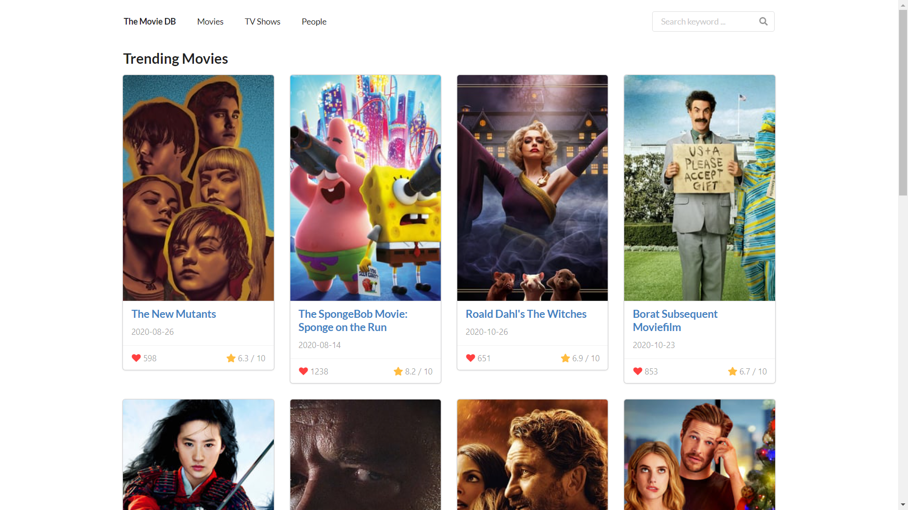
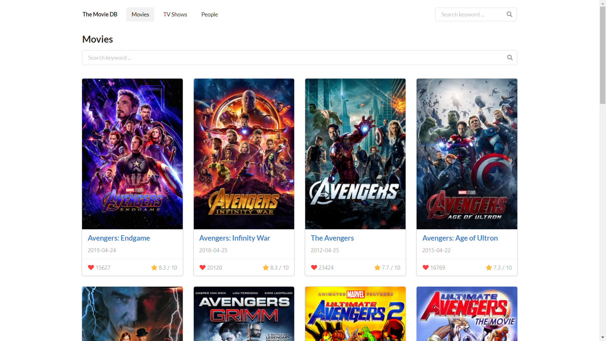
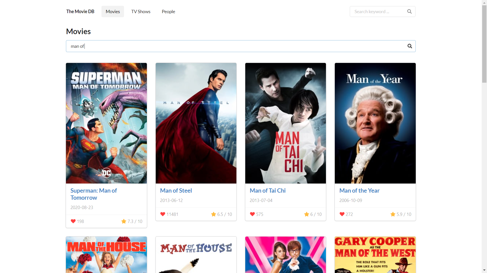
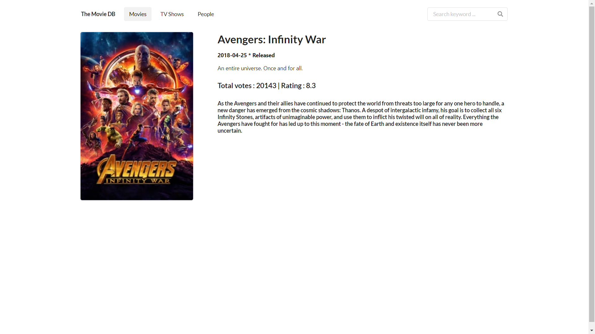

##   The Movie DB
This project uses the The Movie DB API. I have already implemented the following things : 

### Landing page
This is the home page of this application which shows the trending movies and trending tv series of the current week.  

 

### Movies page
This page gets all the movies details like their name, release date, ratings and number of people who like that particular movie. The movies page has infinite scroll implemented with lazy loading.
 

### Search option
You can also search for specific movie you want to know about and further click on the desired result to know more about that particular movie.

### Get Movie Details
You can now view the details about the movie you select with no delay.

